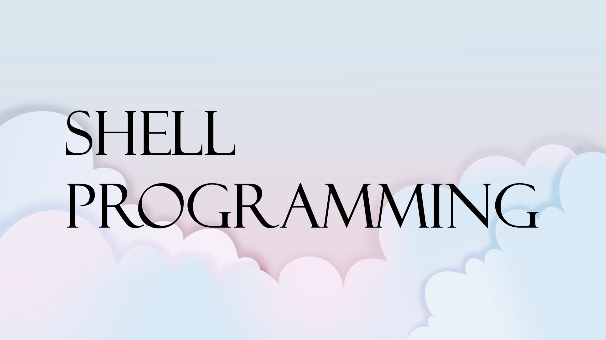

# Shell Programming

 

---
## Table of Contents

* [Shell Commands](ShellScripts)
* [Cheat Sheets](Files/Cheatsheets)

 

---

## Overview
이 저장소에는 unix 계열 OS에서 활용할 수 있는 shell scrip, 또는 shell programming과 관련된 예시 및 설명이 담겨 있습니다. 
This repository contains examples and explanations related to shell scripts or shell programming that can be utilized in unix-like OS. 
 
모든 명령과 활용례가 담겨 있는 것은 아니나, 실제로 유용하게 사용할 수 있는 shell command 위주로 설명할 예정입니다. 
Although not all commands and usage examples are included, we will focus on shell commands that are actually useful. 

 

---

## License
*이 저장소 자체의 콘텐츠는 Creative Commons Attribution 3.0 라이선스에 따라 라이선스가 부여되며 해당 콘텐츠의 형식을 지정하고 표시하는 데 사용되는 기본 소스 코드는 MIT 라이선스에 따라 라이선스가 부여됩니다.* 
*The content of this repository itself is licensed under the Creative Commons Attribution 3.0 license and the underlying source code used to format and display that content is licensed under the MIT license.*

Copyright (c) 2023 Kim Raymond